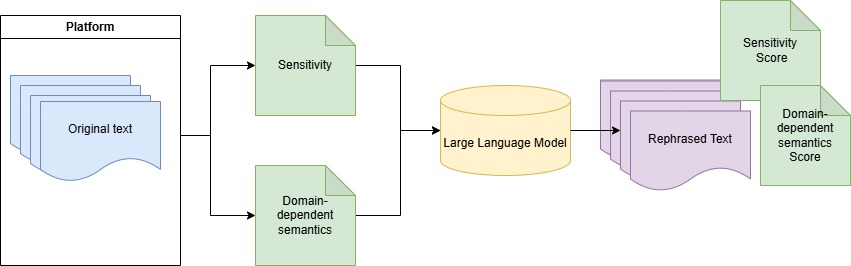

#### Mitigating user’s self-disclosure in digital platforms with ChatGPT

This repository contains the generation/analytics code and data for the paper "Mitigating user’s self-disclosure in digital platforms with ChatGPT"


We provide notebooks that were used to generate the data and the code for the analysis of the data. 
The filtered sensitive data is provided in this repository, the full dataset can be obtained from the original source.

All the tools required to run all the scripts can be installed by running the following command:
```bash
pip install -r requirements.txt
```

## The main notebooks are:
- `analytics/anlysis_ASC.ipynb` - This notebook contains the analysis of the MedSD dataset that resulted in the the file `processed.csv`. This noteboook also contains the API calls to OpenAI's ChatGPT API.
- `experiment/amazon_rephrase2.ipynb` - This notebook contains the API call to OpenAI's ChatGPT API for the Amazon dataset.
- `analytics/hist_plot_hm.ipynb` - This notebook contains the analysis of the scores on the Amazon dataset.
- `semantic_similarity.py` - This notebook contains the evaluation of the semantics similarity.


## Files 

- `df_checked.csv` - This file contains the selected Amazon reviews processed with ChatGPT (rephrasing, sensitivity scoring, informativeness scoring). Each review was processed 10 times by ChatGPT to assess the score stability. 
- `processed.csv` - This file contains a sample of texts from the MedSD dataset that were processed using ChatGPT (rephrasing and sensitivity score). 
- `analysed_sample.csv` - This file contains a sample of texts from the MedSD dataset that were analyzed for semantic similarity, using both a model and human evaluations.

## Figures
In the folders `figures` and `figures-amazon` there are the plots presented in the paper.

## Pipeline for generating rephrasing of reviews



